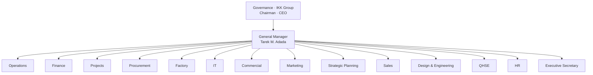

# Adada & Kabbani — Organization Chart
## Design Brief for Claude Design · v2 "The Measured Page"

**Task:** Design the A&K organization chart as a **true connected hierarchy** — every node
joined to its parent by drawn connectors, laid out so the reporting logic is instantly legible
and the whole reads as one measured, engineered drawing. This lives **inside** the company
profile (`A&K Company Profile.html`), immediately after the Leadership sheet.

**This brief supersedes item B of `AK_Profile_Expansion_Brief.md`.**
**Content source of truth:** `uploads/AK_Company_Profile.md` §03 (Organizational Structure).

---

## 1 · Objective

Not a list, not a table, not shadowed boxes. A **line-diagram org tree**: nodes connected by
1px charcoal **orthogonal** connectors (vertical drops + horizontal bus lines; never diagonal),
in Optima, on bone. It must satisfy three things at once:
1. **Correct** — the connections match §03 exactly.
2. **Legible** — the tier and the reporting path of any node is obvious at a glance.
3. **Beautiful** — balanced, symmetrical where possible, generous whitespace, aligned to the grid.

Budget: **two A4 portrait sheets** — **Sheet 1** the executive structure (governance → GM →
function heads); **Sheet 2** the departmental detail (each head with its reports).

---

## 2 · Locked design language (match the rest of the profile)

- **Optima only.** Node name = Optima regular ~13.5px, charcoal. Title = tracked-caps
  "data voice" ~9px, `--label-quiet` (AA-safe; never a lighter grey). Zone labels = tracked-caps.
- **Three colours.** Bone ground; **charcoal** for every node rule and connector; **oxblood**
  used once only — the GM node keyline (or the single spine from the board to the GM). Oxblood
  never on more than one element.
- **Node style.** Bone fill, **1px charcoal hairline**, **sharp corners** (`radius:0`), equal
  widths within a tier, name over title, comfortable padding (≈10–12px). No icons, no photos,
  no shadow, no rounded anything, no fill tints.
- **Connector grammar.** 1px lines. Parent drops vertically to a horizontal **bus**; the bus
  spans its children; each child drops vertically from the bus to its node top-centre. All right
  angles. Keep connector colour `--hair`-to-charcoal; consistent everywhere. Line up drops on
  a shared vertical rhythm.
- **Sheet furniture.** Registration marks (4 corners), one datum line + coordinate
  (`Organization` / `Structure`), column reveal optional and faint, persistent footer
  (running title left · monogram + plate tag right), plate tag renumbered to the profile's
  final sequence. **No grain line** (this is a structural sheet).
- **Cedilla caution** does not apply here, but keep all tracked-caps labels clean.

---

## 3 · The hierarchy — exact connections (from §03)

Build these edges precisely. `→` means "reports to". Names in *italics* are unnamed in the
source — show the **role** and leave the name slot blank or "—", and flag to confirm.

**Tier 0 · Governance (Isam Khairi Kabbani Group)**
- Hassan I. Alkabbani — Chairman
- Amr M. Alkabbani — CEO
  *(These two sit above the company as group governance; connect them as a paired top node that
  drops to the GM. Label the tier "Governance · IKK Group".)*

**Tier 1 · Company lead**
- **Tarek M. Adada — General Manager, A&K** → Board.
  *(The source §03 labels him "CEO"; use **General Manager** to match the corrected Leadership
  sheet. Flag the discrepancy to the client.)* Emphasise this node (oxblood keyline).

**Tier 2 · Function heads → General Manager** (14 nodes)
1. Head of Operations — Faysal Alkabbani
2. Head of Finance — Ismat Abukarroun
3. Projects Director — Georges Michael
4. Head of Procurement — *(unnamed)*
5. Factory Manager — Ahmad Muhankar
6. IT Manager — Ziyad Adada
7. Commercial Manager — Issam AlSayed
8. Marketing Manager — *(unnamed)*
9. Strategic Planning & Development Manager — Waseem Solmon
10. Head of Sales — Suhaib Nassar
11. Head of Design & Engineering — *(unnamed)*
12. Head of QHSE — Motasem Alherani
13. Head of HR — Hasan Al Bisisi *(titled Senior HR Supervisor in source)*
14. Executive Secretary — John Gabato *(staff role to the GM)*

**Tier 3 · Reports → their Tier-2 head**
- **Finance** → Accounts Manager Muhammad Othman · Cost Controller Sayed Qasem
- **Projects** → Project Managers · Site Architect Manager Ahmad Solaiman · Site Engineers · Site Supervisors
- **Procurement** → Sourcing & Vendor Specialist · Purchasing & Buying Specialist Raja Khayaat · Material Planning & Control Engineer Neena Sathish · Compliance & Documentation Officer
- **Factory** → Production Manager Sayed Khadir · Warehouse Manager Yosef Ouf · Maintenance Manager Manik Mia · Panel Processing / Packing & Delivery / Assembly & Finishing / Carpentry / Metal & Wrought Iron supervisors · Production & Capacity Planning Engineer Rajeev Nair
- **IT** → System Analyst & ERP Developer Abdulwasie Mushtaq · IT Officers Jawad Abdulwahid, Salman AlQandeel
- **Commercial** → Assistant Commercial Manager Thomas George · Quantity Surveyor Talha Taj
- **Marketing** → Graphic Designer Ola AlMojadidi · Photographer Amro Qari · AI Marketing Specialist Omar Adada
- **Sales** → Joinery & Cabinetry Estimator Abdo Feghali · Sales Engineers
- **Design & Engineering** → Design Manager Albert Rausa *(Sr Interior Designer Rahaf Bokhari · Junior Interior Designers · Architect Adonis Perez · Draftsman Stanly Daniel · 3D Visualizer · Digital Construction Manager · BIM team)* and Technical Manager Mohammad Suroor *(Senior / Technical Engineers)* — a **two-manager sub-branch** under the head.
- **QHSE** → QMS Manager Mohammad Othman · QA/QC Manager Ryan Magallanes · HSE Manager Mamoun · QC Engineers · Safety Officers · Environmental & HSE Engineers
- **HR** → HR Officers · Legal — Mansour AlSulami
- (Operations, Strategic Planning, Executive Secretary have no named reports in the source — leave them as leaf nodes.)

### Logical reference (structure only — NOT the visual style)

*(Mermaid is only to confirm the edges. The built chart must be the hand-drawn 1px
line-diagram described in §2 — do not render mermaid into the profile.)*

---

## 4 · Making 14 heads legible & beautiful (the layout call)

Fourteen nodes cannot sit in one honest row on A4 portrait and stay readable. Resolve it like
an engineer, not by shrinking type:

**Sheet 1 — Executive structure.**
- Top: the paired **Governance** node (Chairman + CEO in one hairline group, IKK Group label).
- A single emphasised drop (this one line may be oxblood) to the **GM** node, centred.
- From the GM, one horizontal **bus**, and beneath it the 14 heads arranged in **four
  grid-aligned zones** so the eye groups them meaningfully. Zones are **visual grouping only**
  (a tracked-caps zone label above each group + a light bracket) — they are **not** an invented
  management layer; every head still connects to the GM's bus.
  - **Delivery** — Projects · Factory · Operations · Procurement
  - **Design & Quality** — Design & Engineering · QHSE
  - **Commercial** — Sales · Commercial · Marketing
  - **Corporate & Support** — Finance · IT · HR · Strategic Planning · Executive Secretary
- Equal node widths, equal gutters (8px scale), zones balanced left-to-right, bus centred on
  the GM. Aim for symmetry; let whitespace carry the calm.

**Sheet 2 — Departmental detail.**
- Repeat each Tier-2 head small at the top of its own **column**; beneath it, an **indented
  sub-tree**: a short vertical spine with a tick + connector to each Tier-3 report (name +
  tracked-caps title). Align columns to the 12-col grid; align report baselines across columns
  for a ruled, measured feel.
- Design & Engineering shows its **two-manager branch** (Design Manager / Technical Manager)
  before their reports.
- Group the columns in the same four zones as Sheet 1 so the two sheets read as one system;
  carry a "2 of 2" datum coordinate.

**Aesthetic rules:** one connector weight throughout; right angles only; no crossing lines
(reorder siblings to avoid crossings); consistent vertical rhythm; nodes never touch a rule or
the margin; leave the page breathing room top-anchored below the header. If a zone is dense,
give it its own sub-bus rather than cramming.

---

## 5 · Accuracy locks

- Reproduce names, titles and reporting lines **exactly** from §03; do not invent, merge, or
  reorder reporting relationships (only reorder siblings for visual clarity).
- Unnamed heads (Procurement, Marketing, Design & Engineering) → show the role, blank name,
  flag to confirm.
- GM title = **General Manager** (reconcile the source "CEO", flag).
- Governance (Chairman Hassan I. Alkabbani, CEO Amr M. Alkabbani) belongs to the **IKK Group**
  tier above the company.

---

## 6 · Handoff

1. Insert the two org sheets after Leadership; renumber all plate tags/footers to the profile's
   new total; keep the count a multiple of 4 at export.
2. Proof both at full `794 × 1123px`: verify no connector crosses a node, no label drops below
   AA contrast, every reporting line traces cleanly to the GM, and the two sheets share one
   visual system.
3. Re-push `A&K Company Profile.html` to the A&K Design System project root.

*Governing concept: the measured page — the structure is drawn, connected, and measured, in A&K's own hand.*
