# Adada & Kabbani — Organization Chart

*Source: A&K Company Profile §03 (Organizational Structure). Names in _(italics)_ are unnamed
in the source — role shown, name to confirm. The source labels Tarek M. Adada "CEO" in the org
section; shown here as **General Manager** to match the corrected Leadership page (to confirm).*

---

## Hierarchy

- **Governance — Isam Khairi Kabbani (IKK) Group**
  - Hassan I. Alkabbani — **Chairman**
  - Amr M. Alkabbani — **CEO**
  - **↓**
  - **Tarek M. Adada — General Manager, Adada & Kabbani**

### Reporting to the General Manager

- **Head of Operations** — Faysal Alkabbani
- **Head of Finance** — Ismat Abukarroun
  - Accounts Manager — Muhammad Othman
  - Cost Controller — Sayed Qasem
- **Projects Director** — Georges Michael
  - Project Managers
  - Site Architect Manager — Ahmad Solaiman
  - Site Engineers
  - Site Supervisors
- **Head of Procurement** — _(unnamed)_
  - Sourcing & Vendor Specialist
  - Purchasing & Buying Specialist — Raja Khayaat
  - Material Planning & Control Engineer — Neena Sathish
  - Compliance & Documentation Officer
- **Factory Manager** — Ahmad Muhankar
  - Production Manager — Sayed Khadir
  - Warehouse Manager — Yosef Ouf
  - Maintenance Manager — Manik Mia
  - Supervisors — Panel Processing · Packing & Delivery · Assembly & Finishing · Carpentry · Metal Sheets & Wrought Irons
  - Production & Capacity Planning Engineer — Rajeev Nair
- **IT Manager** — Ziyad Adada
  - System Analyst & ERP Developer — Abdulwasie Mushtaq
  - IT Officers — Jawad Abdulwahid · Salman AlQandeel
- **Commercial Manager** — Issam AlSayed
  - Assistant Commercial Manager — Thomas George
  - Quantity Surveyor — Talha Taj
- **Marketing Manager** — _(unnamed)_
  - Graphic Designer — Ola AlMojadidi
  - Photographer — Amro Qari
  - AI Marketing Specialist — Omar Adada
- **Strategic Planning & Development Manager** — Waseem Solmon
- **Head of Sales** — Suhaib Nassar
  - Joinery & Cabinetry Estimator — Abdo Feghali
  - Sales Engineers
- **Head of Design & Engineering** — _(unnamed)_
  - **Design Manager** — Albert Rausa
    - Senior Interior Designer — Rahaf Bokhari
    - Junior Interior Designers
    - Architect — Adonis Perez
    - Draftsman — Stanly Daniel
    - 3D Visualizer
    - Digital Construction Manager
    - BIM Team
  - **Technical Manager** — Mohammad Suroor
    - Senior / Technical Engineers
- **Head of QHSE** — Motasem Alherani
  - QMS Manager — Mohammad Othman
  - QA/QC Manager — Ryan Magallanes
  - HSE Manager — Mamoun
  - QC Engineers
  - Safety Officers
  - Environmental & HSE Engineers
- **Head of HR** — Hasan Al Bisisi _(Senior HR Supervisor)_
  - HR Officers
  - Legal — Mansour AlSulami
- **Executive Secretary** — John Gabato

---

## Functional zones (for grouping / layout)

Visual grouping only — every head reports to the General Manager.

| Zone | Function heads |
|---|---|
| **Delivery** | Projects · Factory · Operations · Procurement |
| **Design & Quality** | Design & Engineering · QHSE |
| **Commercial** | Sales · Commercial · Marketing |
| **Corporate & Support** | Finance · IT · HR · Strategic Planning · Executive Secretary |

---

## Diagram

```mermaid
graph TD
  BOARD["Governance · IKK Group — Chairman · CEO"] --> GM["General Manager<br/>Tarek M. Adada"]

  GM --> OPS["Head of Operations<br/>Faysal Alkabbani"]
  GM --> FIN["Head of Finance<br/>Ismat Abukarroun"]
  GM --> PRJ["Projects Director<br/>Georges Michael"]
  GM --> PROC["Head of Procurement"]
  GM --> FAC["Factory Manager<br/>Ahmad Muhankar"]
  GM --> IT["IT Manager<br/>Ziyad Adada"]
  GM --> COM["Commercial Manager<br/>Issam AlSayed"]
  GM --> MKT["Marketing Manager"]
  GM --> SPD["Strategic Planning & Development<br/>Waseem Solmon"]
  GM --> SAL["Head of Sales<br/>Suhaib Nassar"]
  GM --> DE["Head of Design & Engineering"]
  GM --> QHSE["Head of QHSE<br/>Motasem Alherani"]
  GM --> HR["Head of HR<br/>Hasan Al Bisisi"]
  GM --> SEC["Executive Secretary<br/>John Gabato"]

  FIN --> FIN1["Accounts Mgr — Muhammad Othman"]
  FIN --> FIN2["Cost Controller — Sayed Qasem"]

  PRJ --> PRJ1["Site Architect Mgr — Ahmad Solaiman"]
  PRJ --> PRJ2["Project Managers · Site Engineers · Supervisors"]

  PROC --> PROC1["Purchasing — Raja Khayaat"]
  PROC --> PROC2["Material Planning — Neena Sathish"]
  PROC --> PROC3["Sourcing / Compliance"]

  FAC --> FAC1["Production Mgr — Sayed Khadir"]
  FAC --> FAC2["Warehouse Mgr — Yosef Ouf"]
  FAC --> FAC3["Maintenance Mgr — Manik Mia"]
  FAC --> FAC4["Planning Eng — Rajeev Nair"]
  FAC --> FAC5["Line Supervisors"]

  IT --> IT1["ERP Developer — Abdulwasie Mushtaq"]
  IT --> IT2["IT Officers — J. Abdulwahid · S. AlQandeel"]

  COM --> COM1["Asst Commercial Mgr — Thomas George"]
  COM --> COM2["Quantity Surveyor — Talha Taj"]

  MKT --> MKT1["Graphic Designer — Ola AlMojadidi"]
  MKT --> MKT2["Photographer — Amro Qari"]
  MKT --> MKT3["AI Marketing — Omar Adada"]

  SAL --> SAL1["Estimator — Abdo Feghali"]
  SAL --> SAL2["Sales Engineers"]

  DE --> DEM["Design Mgr — Albert Rausa"]
  DE --> TEM["Technical Mgr — Mohammad Suroor"]
  DEM --> DEM1["Sr Interior Designer — Rahaf Bokhari"]
  DEM --> DEM2["Architect — Adonis Perez"]
  DEM --> DEM3["Draftsman — Stanly Daniel"]
  DEM --> DEM4["3D · Digital Construction · BIM"]
  TEM --> TEM1["Senior / Technical Engineers"]

  QHSE --> Q1["QMS Mgr — Mohammad Othman"]
  QHSE --> Q2["QA/QC Mgr — Ryan Magallanes"]
  QHSE --> Q3["HSE Mgr — Mamoun"]
  QHSE --> Q4["QC · Safety · Environmental"]

  HR --> HR1["HR Officers"]
  HR --> HR2["Legal — Mansour AlSulami"]
```

---

*Adada & Kabbani — organization structure · spans the Makkah factory, live projects, and the Riyadh office.*
